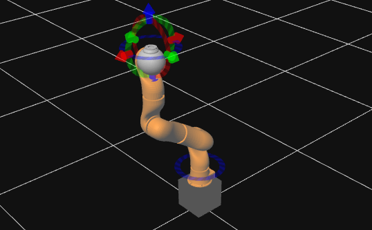

# Project 4 | Robot Arms - Cartesian Control

```
$ roslaunch cartesian_control cartesian_exec.launch
$ rosrun cartesian_control cartesian_control.py
```

## Description

In this project it will be applied the topics learned about differential kinematics, the numerical computation of the Jacobian and singularity avoidance. The aim of this project is to write a Cartesian controller for the same 7-joint robot arm that was used in the last project. This controller will allow the user to **interactively move the end-effector** by dragging around an interactive marker.

As the robot has 7 joints, it has a redundancy and it can also be implement the null-space control. In this assignment, the goal of null-space control is to change the value of the first joint (thus turning the "elbow" of the robot) without affecting the pose of the end-effector (specified above as a primary goal).

### The 'cartesian_control(...)' function

The `cartesian_control` package, which in turn contains the `cartesian_control.py` file that has to be edited. The arguments to the `cartesian_control` function are the following:

- **`joint_transforms`**: a list containing the transforms of all the joints with respect to the base frame. In other words, `joint_transforms[i]` will contain the transform from the base coordinate frame to the coordinate frame of joint i.
- **`b_T_ee_current`**: current transform from the base frame to the end-effector.
- **`b_T_ee_desired`**: desired transform from the base frame to the end-effector.

In addition, the parameters below are relevant in order to implement the null-space control:

- **`red_control`**: boolean telling you when the Cartesian Controller should take into account the secondary objective for null-space control. This is only set to True when the user interacts with the control marker dedicated to the first joint of the robot.
- **`q_current`**: list of all the current joint positions
- **`q0_desired`**: desired position of the first joint to be used as the secondary objective for null-space control. Again, the goal of the secondary, null-space controller is to make the value of the first joint be as close as possible to `q0_desired`, while not affecting the pose of the end-effector.

The function must return a set of joint velocities such that the end-effector moves towards the desired pose. If you are also implementing null-space control and red_control is set to true, the joint velocities must also attempt to bring `q[0]` as close to `q0_desired` as possible, without affecting the primary goal above.

## Algorithm Overview

The problem we are aiming to solve with a Cartesian controller is the following: If we have a robot that allows us to directly set joint velocities, what velocities do we set such that the robot achieves a desired end-effector position? Given the parameters listed above, a high level overview of the algorithm to achieve this could be:

- compute the desired change in end-effector pose from `b_T_ee_current` to `b_T_ee_desired`. A couple of important points: a) at some point, you will need to go from a desired rotation expressed as a rotation matrix to the same desired rotation expressed as 3 numbers (rotations around the x, y and z axes). In the same file, you will find a helper function called `rotation_from_matrix()` that, given a rotation expressed as a matrix, gives you the same rotation expressed as an angle around an axis in space. You might find this function helpful. b) it is also important to remember that, eventually, you will need to compute the desired pose change of the end-effector expressed in its own coordinate frame, not in the base frame.
- convert the desired change into a desired end-effector velocity. This is essentially a velocity controller in end-effector space. The simplest form could be a proportional controller, where the velocity is equal to the desired change scaled by a constant. You also might want to normalize the desired change if it is larger than a certain threshold to obtain a maximum end-effector velocity (e.g. 0.1 m/s and 1 rad/s).
- Numerically compute the robot Jacobian. For each joint compute the matrix that relates the velocity of that joint to the velocity of the end-effector in its own coordinate frame. Assemble the last column of all these matrices to construct the Jacobian.
- Compute the pseudo-inverse of the Jacobian. Make sure to avoid numerical issues that can arise from small singular values.
- Use the pseudo-inverse of the Jacobian to map from end-effector velocity to joint velocities. You might want to scale these joint velocities such that their norm (or their largest element) is lower than a certain threshold.
- If you are not implementing null-space control, you can return these joint velocities.
- If you choose to implement null-space control of the first joint, find a joint velocity that also brings that joint closer to the secondary objective. Use the Jacobian and its pseudo-inverse to project this velocity into the Jacobian nullspace. Be careful to use the 'exact' version of the Jacobian pseudo-inverse, not its 'safe' version. Then add the result to the joint velocities obtained for the primary objective.
- Return the resulting joint velocities, which will then be sent to the robot.



